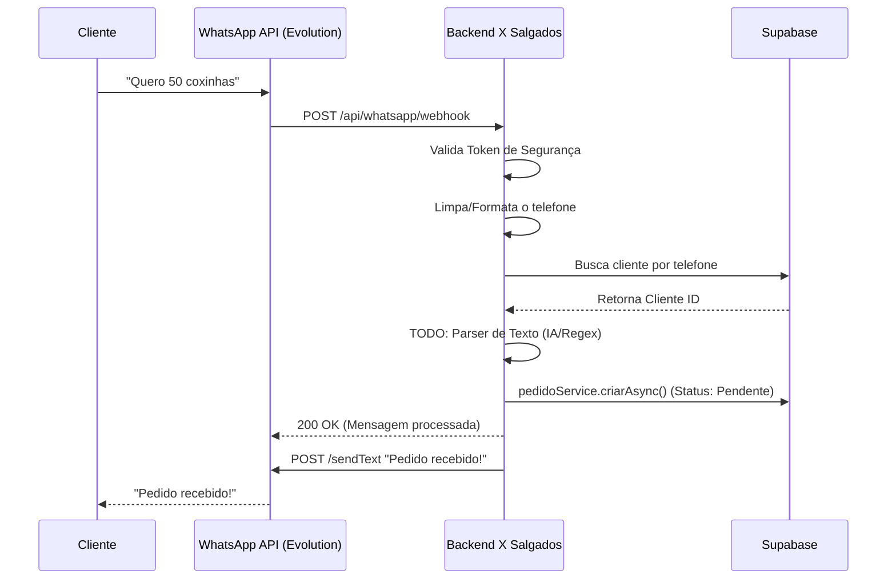

# Integração WhatsApp (Webhook)

Este documento descreve a arquitetura e o fluxo de dados para integrar o sistema "X Salgados" a um serviço de API não oficial do WhatsApp (como Evolution API, Baileys, ou WAPI).

## 1. Visão Geral da Arquitetura

O sistema passará a atuar como um **consumidor de Webhooks**. O serviço de mensageria (API do WhatsApp) enviará um `POST` para o nosso backend sempre que uma nova mensagem for recebida no número do estabelecimento.



## 2. Ponto de Entrada (Endpoint)

Criamos uma nova rota: `POST /api/whatsapp/webhook`

### Segurança
Para evitar que pessoas mal intencionadas chamem nosso webhook enviando pedidos falsos, utilizamos uma camada de autenticação baseada em token, configurada no cabeçalho ou query param da plataforma de envio.
- **Header esperado:** `x-whatsapp-token` ou `Authorization: Bearer <TOKEN>` (configurado via `.env`).

## 3. Estrutura Esperada do Payload

O payload exato depende da API (Evolution API é diferente da Z-API, por exemplo). Para isolar nosso domínio dessa variação, o `whatsapp.controller.ts` é o adaptador que traduzirá o payload da ferramenta terceira para um objeto estruturado padrão, como:

```typescript
{
  numero: string; // Ex: "5511999999999"
  texto: string; // Ex: "Quero 50 coxinhas"
  nomeContato: string; // Ex: "João da Silva"
}
```

## 4. Regras de Negócio e Fluxo (`whatsapp.service.ts`)

O serviço será responsável por:
1. **Limpeza do telefone**: Garantir que o número esteja no formato salvo no banco (`clientes.telefone`). Remover non-digits (`+`, `-`, ` `) e potencialmente ajustar o 9º dígito.
2. **Identificação do Cliente**: Consultar via Supabase (`single()`).
   - *Se não existir:* Ignoramos ou respondemos com "Você não está cadastrado. Acesse o cardápio: https://...".
3. **Parseamento do Pedido**:
   - Inicialmente terá um TODO indicando o local da inserção de IA ou Regex para tradução de "Quero 50 coxinhas" para `{ produtoId, quantidade }`.
   - Inserimos produtos padrões temporariamente para fechar o ciclo do pedido.
4. **Criação do Pedido**:
   - Chamar a função já existente `pedidoService.criarAsync()`, que criará o pedido com status `Pendente` (`1`) e realizará todos os cálculos financeiros com os retornos do Supabase.
